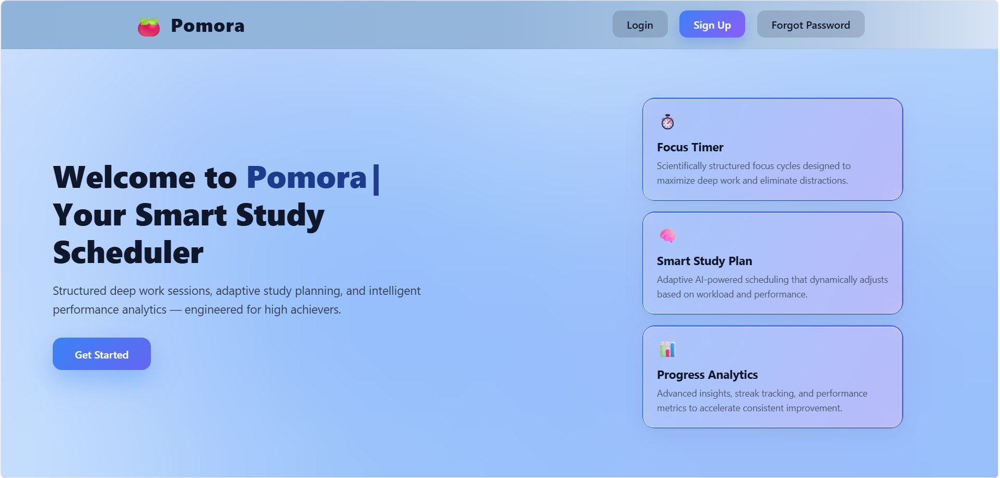
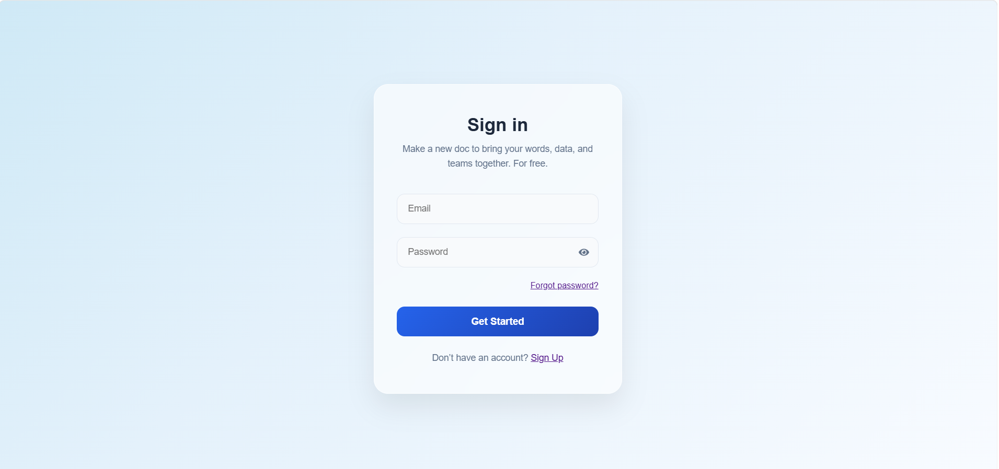
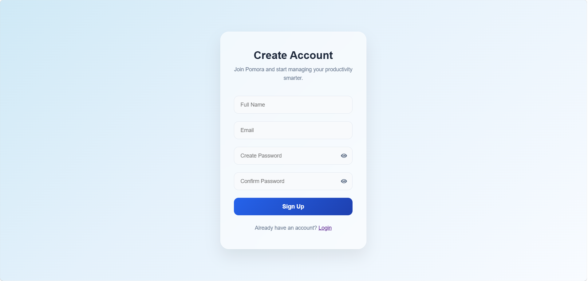
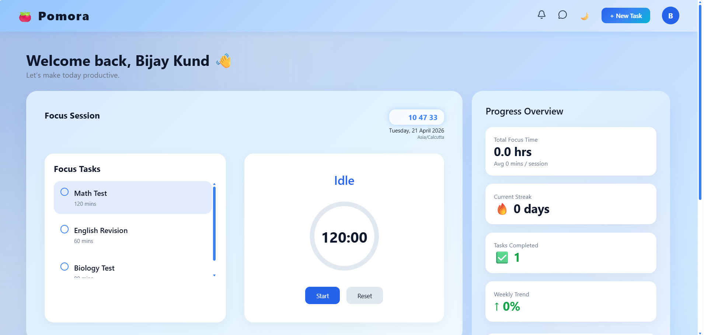
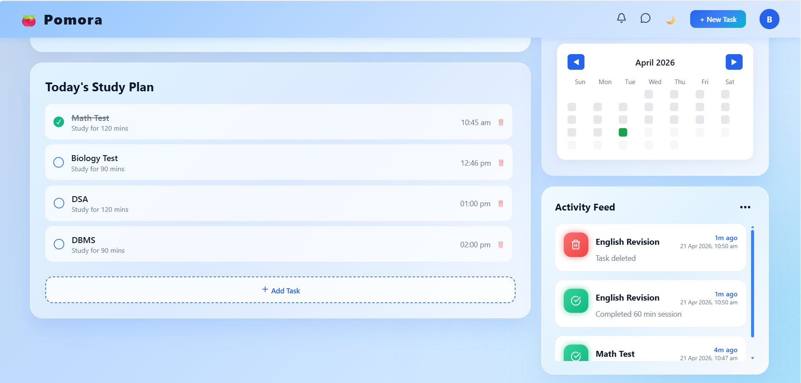
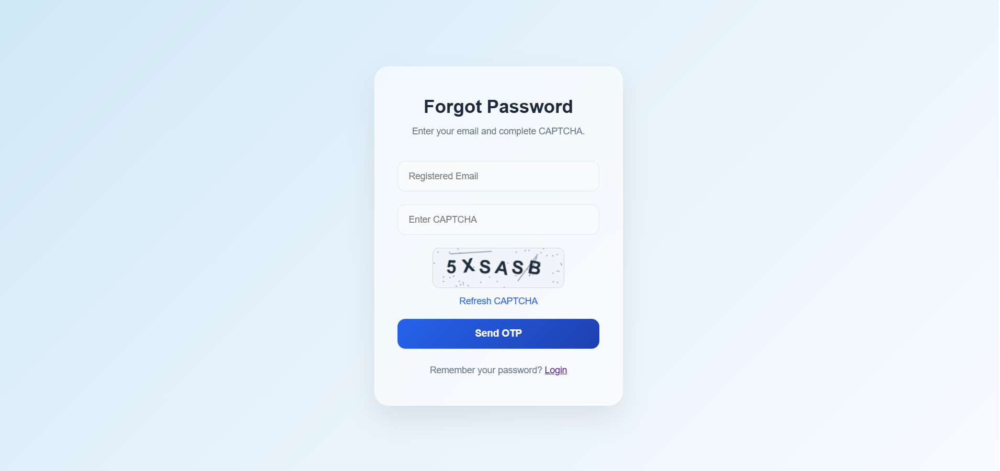
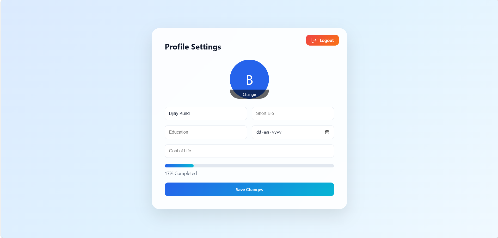

Pomora is a smart productivity web application built using the Pomodoro Technique to help students manage time, organize tasks,
and track study performance with real-time insights.

It combines task planning, session tracking, and analytics into a single intuitive dashboard to improve focus and consistency.

## 🚀 Key Features

- ⏱️ Pomodoro Timer – Structured focus sessions for deep work  
- 📝 Task Management – Create, update, and track daily study tasks  
- 📊 Interactive Dashboard – Visualize productivity and progress  
- 🔔 Activity Feed – Monitor recent study actions in real-time  
- 📅 Calendar View – Track consistency and study streaks  
- 🔐 Authentication System – Secure login & user management  

🖥️ Screenshots:-

🏠 Home Interface

🔐 Authentication
 

📊 Dashboard Overview
 

🔑 Password Recovery

🔓 Logout

## 🛠️ Tech Stack

### 🎨 Frontend
- React.js (Component-based UI)
- HTML5, CSS3, JavaScript (ES6+)
- Responsive Design

### ⚙️ Backend
- Node.js (Runtime Environment)
- Express.js (REST API Development)

### 🗄️ Database
- MongoDB (NoSQL Database)

### 🔐 Authentication & Security
- Firebase Authentication

### 🔗 APIs & Communication
- RESTful APIs (Client-Server Architecture)

### 🧰 Tools & Development
- Git & GitHub (Version Control)
- npm (Package Management)
- Vite (Frontend Build Tool)

📈 Future Enhancements:-

- 📱 Fully responsive mobile UI
- 🔔 Smart notifications & reminders
- 🤖 AI-based productivity suggestions
- 📊 Advanced analytics & reports

👨‍💻 Author

Bijay Kund  🔗 https://github.com/Bijaykund8  

⭐ Support

If you found this project useful, consider giving it a ⭐ on GitHub!